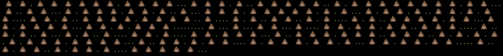

# ErreSpec



> Shit happens.. ~ Mr. Plof

## Installation

Add this line to your application's Gemfile:

```ruby
gem 'errespec'
```

And then execute:

    $ bundle

Or install it yourself as:

    $ gem install errespec

## Using it in a Rails app

*This instructions were brutally stolen from [Ilija Eftimov's cool blog](https://ieftimov.com/how-to-write-rspec-formatters-from-scratch))*

> Lets integrate our new formatter in a Rails application.In the RSpec.configure block in the spec_helper, you need to register the formatter to RSpec. This is done by:

    config.formatter = ErreSpec::Formatters::Plof

## Testing

Errespec is the default formatter for errespec project itself. To see it in action:

    $ bundle exec rspec spec/errespec_spec.rb

## Development

After checking out the repo, run `bin/setup` to install dependencies. Then, run `rake spec` to run the tests. You can also run `bin/console` for an interactive prompt that will allow you to experiment.

To install this gem onto your local machine, run `bundle exec rake install`. To release a new version, update the version number in `version.rb`, and then run `bundle exec rake release`, which will create a git tag for the version, push git commits and tags, and push the `.gem` file to [rubygems.org](https://rubygems.org).

## Contributing

Bug reports and pull requests are welcome on GitHub at https://github.com/[USERNAME]/errespec.
